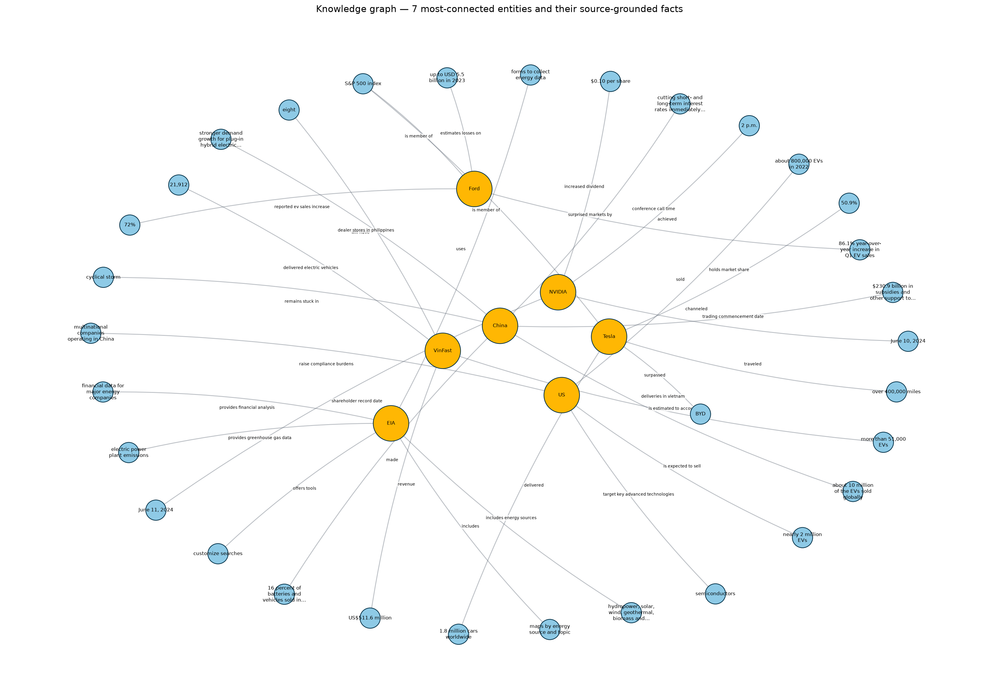

# Báo cáo Day 19: GraphRAG Knowledge Graph

**Học viên:** Nguyễn Lý Minh Kỳ
**MSSV:** 2A202600782

## 1. Câu hỏi nghiên cứu

**Trích xuất thực thể.** LLM có thể phân biệt thực thể với thuộc tính bằng cách sinh các triple có kiểu: tên nút nằm trong `subject` và `object`, còn thông tin mô tả trở thành nhãn quan hệ, bằng chứng, hoặc thuộc tính của nút/cạnh. Trong lab này, tổ chức, con người, chính sách, sản phẩm, địa điểm và công nghệ là các nút. Nhãn quan hệ phụ thuộc extractor: run LLM (`--extractor openai`, dùng cho báo cáo này) sinh predicate `UPPER_SNAKE_CASE` tự do theo ngữ cảnh câu — ví dụ thực tế `ANNOUNCED`, `IS_A_SUBSIDIARY_OF`, `DELIVER`, `REACHED`, `FORECAST`, `WAS`, `HAD`; còn extractor heuristic offline dùng tập nhãn cố định, bảo thủ như `REPORTS_FINANCIAL_RESULT`, `REPORTS_SALES`, `REPORTS_POLICY` và `MENTIONS`.

**Khử trùng lặp đồ thị.** Khử trùng lặp quan trọng vì những tên lặp như `Google`, `Alphabet` hoặc `Google LLC` có thể chia cắt một thực thể thật thành nhiều nút. Đồ thị bị phân mảnh làm giảm degree centrality, phá vỡ duyệt nhiều hop và có thể khiến bước trả lời bỏ sót bằng chứng.

**BFS so với tìm kiếm vector.** Tìm kiếm vector truy xuất độc lập các đoạn văn tương đồng về ngữ nghĩa. BFS mở rộng từ một thực thể đã khớp qua các cạnh tường minh, nên phù hợp hơn với câu hỏi nhiều hop cần kết nối công ty với chính sách, sản phẩm, đối tác, nhà cung cấp hoặc hệ quả.

## 2. Tóm tắt triển khai

- Tài liệu nguồn: 70 file văn bản trong `dataset/`.
- Triple ngữ nghĩa đã trích xuất: 331.
- Knowledge graph: 597 nút và 993 cạnh có hướng.
- Backend đồ thị: NetworkX `MultiDiGraph`.
- Flat RAG baseline: truy xuất TF-IDF trên toàn bộ tài liệu.
- GraphRAG: khớp thực thể, sau đó duyệt đồ thị tối đa 2 hop với bằng chứng truy nguyên được nguồn. Có thể bật tổng hợp câu trả lời bằng LLM qua `--answer-with-llm`.

## 3. Ảnh Knowledge Graph



## 4. Tóm tắt benchmark

Benchmark gồm 20 câu hỏi được kiểm chứng thủ công; mỗi câu có tài liệu đích, câu trả lời mong đợi, các thuật ngữ bắt buộc và bằng chứng nguồn. Kết quả truy xuất chính như sau:

| Hệ thống | Top-1 | Hit@3 | MRR | Độ bao phủ thuật ngữ trả lời |
| --- | ---: | ---: | ---: | ---: |
| Flat RAG (TF-IDF) | 0.35 | 0.55 | 0.467 | 0.20 |
| GraphRAG (entity + 2-hop) | 0.40 | 0.55 | 0.520 | 0.20 |

Theo thứ hạng tài liệu đích, GraphRAG xếp cao hơn trong 5 trường hợp, Flat RAG cao hơn trong 1 trường hợp và 14 trường hợp hòa. Lần chạy này không có trường hợp chỉ GraphRAG hoặc chỉ Flat RAG tìm được tài liệu đích trong top 3. Kết quả đầy đủ nằm trong [artifacts/benchmark_20.csv](artifacts/benchmark_20.csv).

| ID | Câu hỏi | Hạng Flat RAG | Hạng GraphRAG | Hệ thống xếp cao hơn |
| --- | --- | ---: | ---: | --- |
| B01 | Chế độ chính sách nào gắn với tỷ lệ EV mới 5%, so với 1,3% ở các nơi khác? | 35 | 35 | Hòa |
| B02 | Người Mỹ mua bao nhiêu EV mới trong quý I/2024, và chúng chiếm bao nhiêu doanh số xe mới? | 9 | 4 | GraphRAG |
| B03 | Một số hãng sản xuất EV cung cấp bảo hành pin như thế nào? | 9 | 7 | GraphRAG |
| B04 | Citi dự báo tăng trưởng sản lượng BEV toàn cầu bao nhiêu khi nhận định tâm lý thị trường quá tiêu cực? | 3 | 2 | GraphRAG |
| B05 | Ngành sản xuất EV và pin tại Hoa Kỳ công bố tổng mức đầu tư và số việc làm là bao nhiêu? | 15 | 15 | Hòa |
| B06 | Hiệu suất năng lượng của EV khác xe xăng thế nào theo nguồn EPA? | 3 | 3 | Hòa |
| B07 | Xe điện chạy pin và xe hybrid sạc điện đạt cột mốc doanh số toàn cầu nào vào năm 2019? | 5 | 5 | Hòa |
| B08 | Báo cáo Electric Vehicle Outlook thường niên xem xét những xu hướng giao thông nào cùng với điện hóa? | 10 | 7 | GraphRAG |
| B09 | NVIDIA báo cáo doanh thu quý I kết thúc ngày 28/04/2024 là bao nhiêu? | 3 | 1 | GraphRAG |
| B10 | Polestar báo cáo doanh thu 9 tháng năm 2023 và mức thay đổi theo năm như thế nào? | 1 | 1 | Hòa |
| B11 | VinFast giao bao nhiêu xe trong quý III/2024 và mức tăng trưởng giao xe theo năm là bao nhiêu? | 1 | 1 | Hòa |
| B12 | Số xe ZEEKR giao trong quý I/2024 là bao nhiêu? | 1 | 1 | Hòa |
| B13 | Mercedes-Benz Group báo cáo EBIT và doanh thu năm 2023 là bao nhiêu? | 1 | 1 | Hòa |
| B14 | Nền tảng P7 của REE tuyên bố lợi thế gì về tải trọng và không gian chở hàng? | 1 | 1 | Hòa |
| B15 | Nikola nhận đơn đặt mua bao nhiêu xe tải pin nhiên liệu hydro, và xe tải chở hàng tại California phải tuân thủ hạn chót nào? | 1 | 1 | Hòa |
| B16 | Có bao nhiêu người mua tại Hoa Kỳ chọn EV năm 2023, và EV đạt thị phần bao nhiêu? | 16 | 16 | Hòa |
| B17 | Doanh số EV hạng nhẹ tại Hoa Kỳ tăng hay giảm đến hết quý III/2023? | 1 | 1 | Hòa |
| B18 | Tỷ lệ người trưởng thành ở Hoa Kỳ nói sẽ nghiêm túc cân nhắc EV cho lần mua xe tiếp theo là bao nhiêu? | 2 | 2 | Hòa |
| B19 | Trên 21 thị trường trong quý II/2024, tỷ trọng xe điện hóa và tốc độ tăng doanh số EV được báo cáo là bao nhiêu? | 9 | 9 | Hòa |
| B20 | Doanh số xe chở khách điện hóa toàn cầu năm 2022 là bao nhiêu và dự kiến đạt mức nào vào năm 2030? | 17 | 19 | Flat RAG |

## 5. Điểm yếu Flat RAG / Trường hợp GraphRAG có lợi thế

GraphRAG cải thiện thứ hạng tài liệu đích ở B02, B03, B04, B08 và B09. Trường hợp rõ nhất là B09: GraphRAG đưa nguồn doanh thu quý I/2024 của NVIDIA lên hạng 1, trong khi Flat RAG xếp nguồn này hạng 3. Flat RAG chỉ xếp cao hơn ở B20, dù cả hai phương pháp đều không truy xuất được tài liệu đích trong top 3.

Đánh giá này đo chất lượng truy xuất và độ bao phủ thuật ngữ của câu trả lời có căn cứ nguồn; nó không chấm độc lập hallucination của câu trả lời LLM tự do. Vì vậy benchmark này hỗ trợ so sánh khả năng truy xuất, không đủ cơ sở để kết luận hệ thống nào hallucinate nhiều hơn. Xem [artifacts/evaluation_analysis.md](artifacts/evaluation_analysis.md) để biết phương pháp và diễn giải chi tiết.

## 6. Phân tích chi phí và thời gian

- Model: `gpt-4o-mini`.
- Số lệnh gọi API: 70.
- Token indexing đã đo: 98.105 token (61.252 input; 36.853 output).
- Chi phí indexing ước tính: $0.03129960, với mức $0.15 / 1 triệu input token và $0.60 / 1 triệu output token.
- Thời gian trích xuất OpenAI đầy đủ: 800,173 giây.
- Thời gian dựng lại artifact từ checkpoint đã lưu: 0,488 giây.

Bước indexing một lần chiếm phần lớn chi phí và thời gian vì từng tài liệu nguồn được gửi đến extractor. Lần chạy này không lưu thời lượng benchmark ở query time, nên báo cáo không ước tính số liệu đó. Dữ liệu usage và mức giá đã ghi nằm trong [artifacts/token_usage.json](artifacts/token_usage.json); hồ sơ chạy đầy đủ nằm trong [artifacts/full_llm_indexing.md](artifacts/full_llm_indexing.md).

## 7. Khả năng tái lập

Cài dependency và chạy test:

```bash
make install
make test
```

Dựng lại artifact bằng heuristic extractor mặc định:

```bash
make run
```

Để dựng lại từ checkpoint trích xuất LLM, cấu hình API key và các biến giá, sau đó chạy:

```bash
OPENAI_API_KEY='...' \
OPENAI_INPUT_COST_PER_1M='0.15' \
OPENAI_OUTPUT_COST_PER_1M='0.60' \
uv run python graphrag_lab.py --extractor openai --model gpt-4o-mini
```

Extractor `openai` tái sử dụng các file thành công trong `artifacts/llm_cache/`; do đó một lần chạy đã hoàn tất có thể dựng lại artifact mà không lặp lại các lệnh gọi trích xuất.
